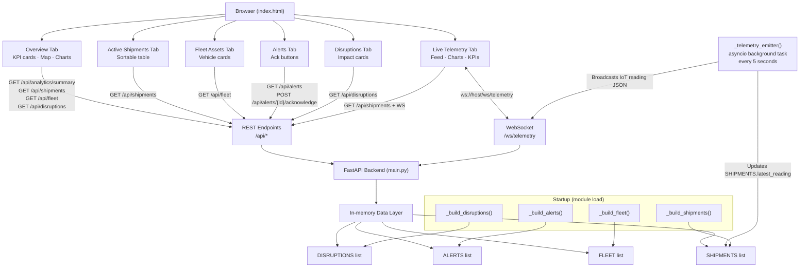

# Architecture

## System Architecture

RapidDeploy is a three-layer system: a vanilla HTML/JS single-page frontend, a FastAPI backend
with REST and WebSocket endpoints, and an in-memory data layer seeded at startup with a
background asyncio task driving real-time telemetry.



## Components

| Component | Technology | File / Module | Responsibility |
|---|---|---|---|
| Frontend SPA | HTML5 · CSS3 · Vanilla JS | `static/index.html` | Tab navigation, API calls, WebSocket client, ECharts, Leaflet map |
| Backend API | FastAPI 0.x · Python 3 | `main.py` | REST endpoints, WebSocket server, CORS, static file serving |
| Data models | Pydantic v2 | `main.py` (lines 100–180) | Request/response validation, serialisation |
| Seed data | Python (RNG seed 42) | `main.py` (lines 231–375) | Deterministic in-memory data generation at startup |
| Telemetry emitter | asyncio | `main.py` — `_telemetry_emitter()` | Background task; generates + broadcasts IoT readings every 5 s |
| WebSocket manager | Python | `main.py` — `_ConnectionManager` | Tracks connected clients, broadcasts, handles disconnects |
| Charts | Apache ECharts 5.4.3 | `static/index.html` (CDN) | Donut, bar, line, pie charts |
| Map | Leaflet.js 1.9.4 | `static/index.html` (CDN) | Interactive India map with shipment markers |
| Tests | pytest + FastAPI TestClient | `test_main.py` | 10 integration tests covering all REST endpoints |

## Data Models

### `Shipment`
```
shipment_id        str          e.g. "SH-001"
origin / destination  str       e.g. "Mumbai" / "Delhi"
carrier            str          e.g. "BlueDart"
vehicle_id         str          e.g. "VH-101"
product_category   str          frozen | refrigerated | pharma | ambient
product_name       str          e.g. "Dairy Products"
status             ShipmentStatus  in_transit | delayed | at_risk | delivered
eta                datetime(UTC)
departure_time     datetime(UTC)
current_location   str
latest_reading     IoTReading
temp_excursion     bool
excursion_duration_min  int
route_progress_pct float
```

### `IoTReading`
```
sensor_id          str          e.g. "SNS-SH-001"
timestamp          datetime(UTC)
temperature_c      float        rounded to 2 dp
humidity_pct       float        40–90%
latitude / longitude  float     GPS with ±0.5° drift per reading
battery_pct        float        20–100%
```

### `FleetAsset`
```
vehicle_id         str          e.g. "VH-101"
vehicle_type       str          Refrigerated Truck | Freezer Van | Pharma Reefer | Standard Truck
driver             Optional[str]
status             FleetStatus  active | idle | maintenance | offline
location           str
latitude / longitude  float
last_active        datetime(UTC)
idle_duration_min  int
fuel_pct           float
assigned_shipment  Optional[str]
mileage_km         int
```

### `Alert`
```
alert_id           str          e.g. "ALT-T001"
severity           AlertSeverity  info | warning | critical
type               str          temperature_excursion | shipment_delayed
shipment_id        Optional[str]
vehicle_id         Optional[str]
message            str          human-readable description
timestamp          datetime(UTC)
acknowledged       bool
```

### `DisruptionEvent`
```
disruption_id      str          e.g. "DIS-001"
type               DisruptionType  weather | port_congestion | customs_delay | vehicle_breakdown | temp_excursion | supplier_outage
affected_shipments List[str]
region             str
description        str
impact_score       float        0.0–10.0
started_at         datetime(UTC)
estimated_resolution  datetime(UTC)
active             bool
```

## Data Flow

1. **Startup** — `_build_shipments()` creates 10 `Shipment` objects with randomised (but
   deterministic, seed=42) IoT readings. `_build_fleet()` creates 15 `FleetAsset` objects.
   `_build_alerts()` iterates shipments and generates `Alert` objects for every excursion and
   every delayed shipment. `_build_disruptions()` creates 5 `DisruptionEvent` objects from the
   `_DISRUPTION_SPECS` data table, computing all timestamps from a single `_now()` call.

2. **API requests** — All REST endpoints read directly from the four in-memory lists. Filtering
   is done with list comprehensions. Writes (alert acknowledgement) mutate the in-memory objects
   directly. No database I/O occurs.

3. **Telemetry push** — `_telemetry_emitter()` runs inside `asyncio.sleep(5)` loop. Each
   iteration: selects a random shipment, calls `_iot()` to generate a new reading using the
   shipment's last GPS coordinates, updates `s.latest_reading` and `s.temp_excursion`, then
   calls `_manager.broadcast(payload)` which iterates all open WebSocket connections and sends
   JSON. Dead connections are collected and removed.

4. **Frontend rendering** — Each tab's loader function fetches from the REST API, transforms
   the JSON into HTML string templates using `Array.map().join('')`, and sets `innerHTML` on
   the appropriate container. Sort state for the shipments table is maintained in `_shipSort`
   and `_shipData` variables; re-sorting never re-fetches.

## Temperature Threshold Logic

```python
TEMP_THRESHOLDS = {
    "frozen":       {"min": -25.0, "max": -15.0},  # °C
    "refrigerated": {"min":   2.0, "max":   8.0},
    "ambient":      {"min":  15.0, "max":  30.0},
    "pharma":       {"min":   2.0, "max":   8.0},
}
```

A reading is classified as an excursion when `temperature_c < min OR temperature_c > max`.
The frontend applies an additional "near-boundary" yellow zone at ±15% of the range for colour
coding: green = safe, yellow = approaching limit, red = excursion.

## Security Considerations

- All API endpoints are open — no authentication or authorisation is implemented. This is a
  hackathon prototype; production deployment would require JWT-based auth on all routes.
- CORS is configured with `allow_origins=["*"]` for development convenience. Production would
  restrict to specific domains.
- No secrets are used or stored — there are no API keys, database credentials, or environment
  variables required to run the application.
- All data is ephemeral in-memory — nothing is persisted between restarts.

## Scalability Notes

The current architecture is intentionally simple (single process, in-memory), but the design
supports a straightforward path to production scale:

| Current (prototype) | Production path |
|---|---|
| In-memory lists | Replace with PostgreSQL + TimescaleDB for time-series IoT data |
| Simulated `_telemetry_emitter()` | Replace with MQTT/AMQP consumer subscribing to real IoT device topics |
| Single FastAPI process | Horizontal scale behind nginx load balancer; WebSocket sessions managed via Redis pub/sub |
| No auth | Add JWT middleware; per-route RBAC for operations manager vs. fleet coordinator roles |
| Polling every 30 s for KPIs | Replace with server-sent events or WebSocket KPI push when analytics change |
